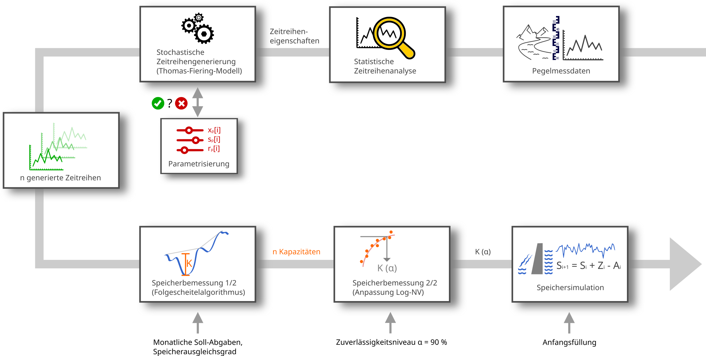

[](https://github.com/lenamueller/StochastischeSpeicherbemessung/actions/workflows/python-app.yml)
[](https://)

# Stochastische Speicherbemessung
Dieses Repository enthält Daten, Code und Analyseergebnisse für die stochastische Speicherbemessung eines Versorgungsspeichers (Teil des Moduls MHYD04 "Flussgebietsbewirtschaftung" der TU Dresden).

# Konzeption


# Anwendung
#### 1. Repository klonen
```bash
git clone git@github.com:lenamueller/StochastischeSpeicherbemessung.git
```
#### 2. Abhängigkeiten installieren
```bash
pip install -r requirements.txt
```
#### 3. Ausführen der Skripte
```bash 
python 1_Zeitreihenanalyse/main.py
python 2_Zeitreihengenerierung/main.py
python 3_Speicherbemessung/main.py
python 4_sonstiges/main.py
```

# Inhalt

### Rohdaten
Durchflussdaten in monatlicher Auflösung für die Pegel Ammelsdorf, Klingenthal, Rothenthal, Seifhennersdorf, Tannenberg, Wiesa.

### 1_Zeitreihenanalyse
- `check_consistency.py`: Überprüfung der Konsistenz der Zeitreihe
- `ceck_homogenity.py`: Überprüfung der Homogenität der Zeitreihe
- `check_stationarity.py`: Überprüfung der Stationarität der Zeitreihe
- `comp_trend`: Analyse der Trendkomponente
- `comp_seasonal`: Analyse der saisonellen Komponente
- `comp_autocorr`: Analyse der autokorrelativen Komponente

### 2_Zeitreihengeneriering
- `thomas_fiering.py`: Stochastisches Zeitreihenmodell (Thomas-Fiering-Modell)

### 3_Speicherbemessung
- `sequent_peak_algorithm.py`: Folgescheitelalgorithmus und Speichersimulation
- `fit_capacity`: Anpassen der Log-NV 
- `reliability.py`: Berechnung der Zuverlässigkeit des Speicherbetriebs

### 4_sonstiges
- `speicherausbaugrad.py`: Berechnung des Speicherausbaugrades

### utils
- `read.py`: Funktionen zum Einlesen der Rohdaten
- `stats.py`: Berechnung statistischer Größen

### docs
- `Workflow.png`: Konzeptionielle Übersicht über die Arbeitsschritte
- `Netzdruck485_Klingenthal.pdf`: Grafische Anpassung der LogNV an die Speicherkapazitäten für den Pegel Klingenthal (Netzdruck Nr. 485)